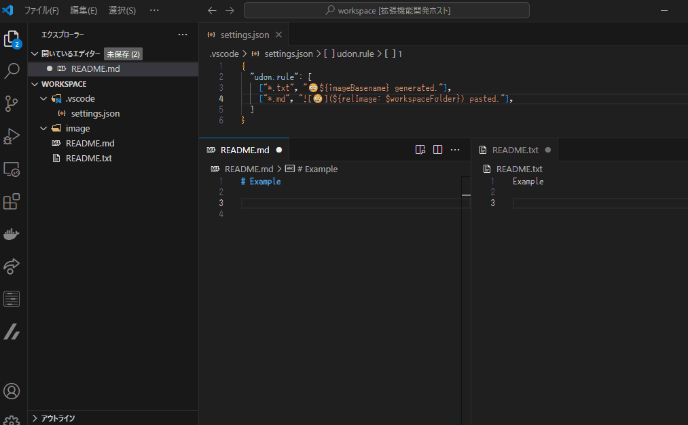
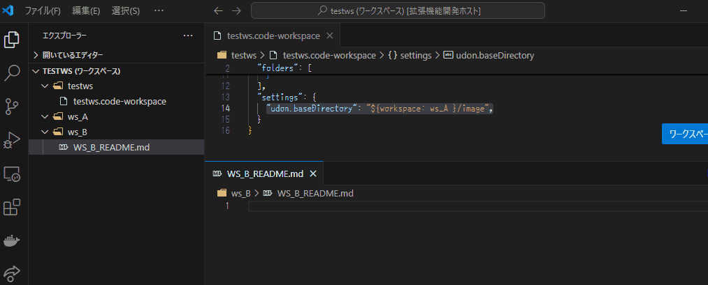

# Udon 🍜

**Udon** は、クリップボードにある画像をファイルに保存し、エディタ内に自動で貼り付ける VSCode プラグインです。

---

## 機能


- **画像保存**: クリップボードの画像を任意の形式・名前で保存。
- **エディタへの挿入**: 保存した画像をリンクとして自動挿入。
- **サイズ調整**: 縮小して保存可能。
- **柔軟なファイル名指定**: カスタムファイル名のサポート。
- **リモート環境で使用可能**: このプラグインは WSL や Remote SSH でも動作します。

---

## インストール

本プラグインは画像の保存に [climg2base64](https://github.com/nodamushi/climg2base64) を使用します。

プラグイン起動時に、下記の対応環境向けに私がビルドしたバイナリを自動的にダウンロードします。

- Windows (x86_64)
- Linux (x86_64, aarch64)

> [!IMPORTANT]
> 私に必要で確認可能な環境向けだけバイナリを作っています。各種環境向けのビルドについてのサポートはできかねます。


対応していない環境では、自分で `climg2base64` をビルドし、そのパスを `udon.execPath` に設定してください。


```sh
cargo install --git https://github.com/nodamushi/climg2base64
```

---

## 使い方

1. **画像をコピー**: クリップボードに画像情報をコピー
2. **コマンド実行**
   -  コマンドパレットから `Udon🍜: Paste Clipboard Image`を実行する
    - デフォルトのショートカットキー: `Ctrl+Alt+V`
3. 画像ファイルが保存され、エディタのファイル名に従って、テキストが入力されます

### 縮小機能

画像を貼り付ける際、指定したサイズに縮小できます。

- `w:pixel` : 最大幅(ピクセル)。`w=`も可
- `h:pixel` : 最大高さ(ピクセル)。`h=`も可

`w:`, `h:` ともにサイズに満たない場合は、縮小は行われません。

**例**

```txt
w:500,h:200
```

### ファイル名を指定して貼り付け

選択範囲からファイル名を指定して保存することもできます。

- `foobar`: foobar.webp。重複があれば連番付き。
- `?foobar`: foobar.webp。ファイルが既に存在してても上書き
- `foobar,w:500,h:200`: foobar.webp。画像が大きい場合は縮小
- `jpg` : デフォルト名.jpg。
- `foobar.jpg`: foobar.jpg。

```txt
foobar
?foobar
foobar,w:500,h:200
jpg
foobar.jpg
```


### 指定可能な画像ファイルフォーマット

- jpeg
- png
- webp
- bmp
- gif
- avif

### 好みの挿入ルールに変更

`udon.rule` 設定を変えることでエディタに挿入されるルールを変えることができます。

```json
"udon.rule": [
  ["*.txt", "😢${imageBasename} generated."],
  ["*.md", " pasted."]
]
```

上記の設定は 拡張子が .txt のファイルと、 .md のファイルに対する設定を書いています。パターンの検索は上から順に行われます。



### デフォルトの保存先、ファイル名の変更

`udon.baseDirectory`、 `udon.baseDirectories`、 `udon.defaultFileName` 設定を変えることで保存ディレクトリ、デフォルトファイル名を変更できます。

注意: `$image〇〇` 、 `$relImage〇〇` を使用することはできません。

####  `udon.baseDirectories`

`udon.baseDirectories` は `udon.rule` と同様に、パターンマッチによって保存先ディレクトリを指定します。設定されたルールは上から順に評価され、一致したパターンが見つかれば、それに対応するディレクトリが保存先として使用されます。どのパターンにも一致しない場合は、`udon.baseDirectory` が使用されます。

以下に例を示します。

```json
"udon.baseDirectories": [
  ["foo/*.md", "${workspaceFolder}/foo/md-img"],
  ["*.md", "${workspaceFolder}/md-img"],
  ["*.txt", "${workspaceFolder}/txt-img"]
]
```

- Markdownファイル（`*/foo/*.md`）を編集している場合、画像は `foo/md-img` フォルダに保存されます。
- Markdownファイル（`*.md`）を編集している場合、画像は `md-img` フォルダに保存されます。
- テキストファイル（`*.txt`）を編集している場合、画像は `txt-img` フォルダに保存されます。
- どのルールにも一致しない場合は、デフォルトの `udon.baseDirectory` 設定が使用されます。

---

## 設定

- `udon.format`: 保存する画像のデフォルトフォーマット
- `udon.saveInWorkspaceOnly` : ワークスペース外への保存を禁止（エラーを表示）
- `udon.execPath` :  [climg2base64](https://github.com/nodamushi/climg2base64) の実行ファイルパス
- `udon.baseDirectory`: 保存先ディレクトリの基準位置
- `udon.baseDirectories`: 保存先ディレクトリの基準位置をパターンマッチで指定
- `udon.defaultFileName`: 保存する画像のデフォルトファイル名
- `udon.rule`: エディタに貼り付けるときの文字列テンプレート
- `udon.suffixLength`: 重複時の連番の桁数（例: 001）。3を指定すると、001のようになる。
- `udon.suffixDelimiter`: 連番とファイル名を区切る文字

## 変数

`udon.baseDirectory`,`udon.defaultFileName`,`udon.rule` で使用可能な変数の一覧を示します。

`udon.baseDirectory`,`udon.defaultFileName` では 画像のパスを取得するタイプの変数は使用できません。

### $date

`$date` は日付の文字列を生成します。


- `${date}`: 2024-1-1 のような日付の文字列を作成
- `${date: YYYY-MM-DD-HH-mm-ss }`: 2024-01-01-14-01-01 の様な文字列を作成

日付に指定できる文字。エスケープなどは実装されていません。

- `YYYY`: 2024 などになる (2024年)
- `YYY`: 024 などになる(2024年)
- `YY`: 24 などになる(2024年)
- `Y`: 4 などになる(2024年)
- `MM`: 2桁指定の月になる (01, 12など)
- `M`: 月になる (1, 12など)
- `DD`: 2桁指定の日付になる (01, 31など)
- `D`: 日付になる (1, 31など)
- `HH`: 2桁指定の時間(24時間)になる (01, 23など)
- `H`: 時間(24時間)になる (1, 23など)
- `hh`: 2桁指定の時間(AM/PM)になる (AM01, PM12など)
- `h`: 時間(AM/PM)になる (AM1, PM12など)
- `mm`: 2桁指定の分になる (00, 59など)
- `m`: 分になる (0, 59など)
- `ss`: 2桁指定の秒になる (00, 59など)
- `s`: 秒になる (0, 59など)

### $workspace

`$workspace` はワークスペースのフォルダパスを取得します。

- `$workspace` : `$workspaceFolder` と同じ結果。エディタのファイルが所属しているワークスペースディリになる。
- `${workspace: foobar}`: foobar ワークスペースのパス。複数のワークスペースフォルダがある場合に、指定のファークスペース フォルダのパスを取得したい場合に使います。



### $relFile, $relFileDir, $relImage, $relImageDir

`$relX` は相対パスを取得します。`$relX` の種類は以下の4つがあります。

- `$relFile`: エディタのファイルの相対パス
- `$relFileDir`: エディタのファイルのあるディレクトリの相対パス
- `$relImage`: 出力したファイルの相対パス。`udon.rule`でのみ使用可能
- `$relImageDir`: 出力したファイルのディレクトリの相対パス。`udon.rule` でのみ使用可能。

`$relX` はどこからの相対パスを取るのかを指定できます。指定していない場合は `$fileDirname` が指定されているものとみなします。

- `${relImage: $workspaceFolder}` : ワークスペースからの相対パス
- `${relImage: ${fileDirname}/img}` : 「ファイルのあるディレクトリ/img」からの相対パス


### 固定変数

以下の変数は引数を取りません。命名規則は [VSCode の 変数](https://code.visualstudio.com/docs/editor/variables-reference) に従っています。

- `$workspaceFolder` : 開いているファイルのワークスペースフォルダ
- `$workspaceFolderBasename` `$workspaceFolder` のディレクトリ名
- `$file` : 開いているファイルのパス
- `$fileBasename` : `$file` のファイル名（拡張子あり）
- `$fileExtname` : `$file` の拡張子(.txt など。.がつきます。)
- `$fileBasenameNoExtension` : `$file` のファイル名（拡張子なし）
- `$fileDirname`, `$fileDir` : 開いてるファイルのあるディレクトリ.
- `$fileDirnameBasename`, `$fileDirBasename` : `$fileDir` のディレクトリ名
- `$image` : 出力した画像のパス
- `$imageBasename` : `$image` のファイル名（拡張子あり）
- `$imageExtname`  : `$image` の拡張子（.jpeg など）
- `$imageBasenameNoExtension` : `$image` のファイル名（拡張子なし）
- `$imageDirname`, `$imageDir` : 出力した画像のディレクトリのパス
- `$imageDirnameBasename`, `$imageDirBasename` : `$imageDir` のディレクトリ名
- `$imageFormat` : 画像ファイルフォーマット

---

## 初期設定 udon.rule

- Markdown
- Textile
- Ascii Dock
- HTML
- Doxygen (C++)

```json
[
  ["*.md", ""],
  ["*.textile", "!${relImage:${fileDirname}}!"],
  ["*.adoc", "image::${relImage:${fileDirname}}[]"],
  ["*.html", ""],
  ["*.cpp", "@image html ${relImage:${workspaceFolder}}"],
  ["*.hpp", "@image html ${relImage:${workspaceFolder}}"],
  ["*", "${relImage:${workspaceFolder}}"]
]
```


---

## 免責事項

- 本プラグインは個人が開発したものであり、利用におけるすべての責任はユーザー自身にあります
- 本プラグインを使用したことによる損害やトラブルについて、開発者は一切の責任を負いません

---

## ライセンス

MIT ライセンス or Unlicense

---

## 推奨事項

このプラグインは私個人のために作っただけです。

 [Paste Imaeg](https://marketplace.visualstudio.com/items?itemName=mushan.vscode-paste-image) の利用をご検討ください。