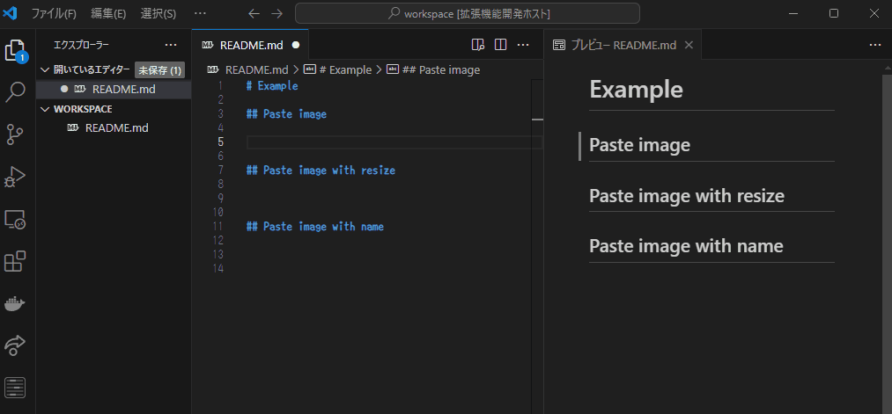
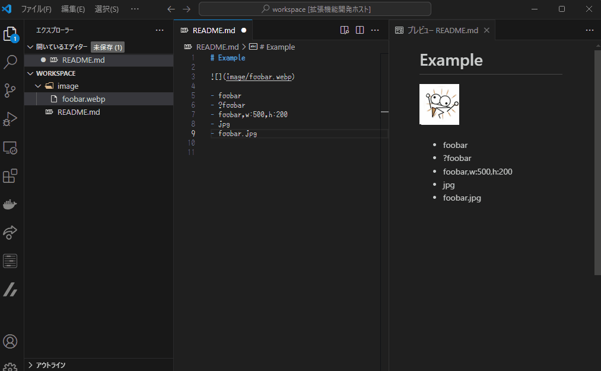
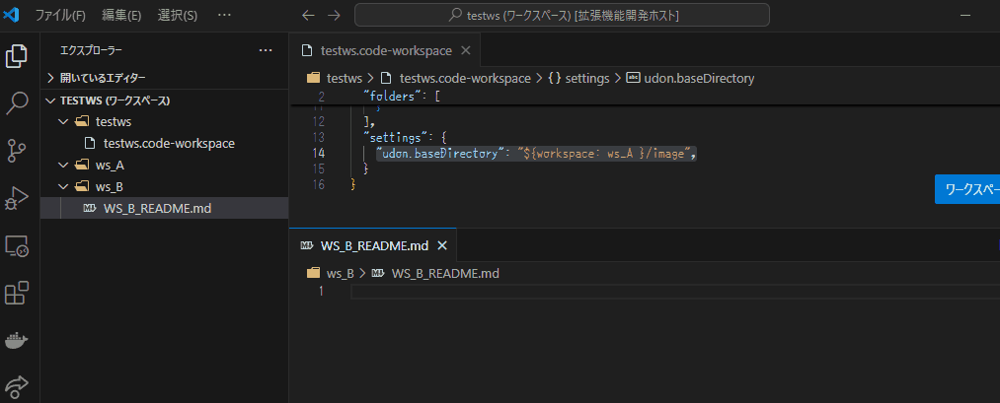

# Udon 🍜

- [日本語(Japanese)](./README.ja.md)

**Udon**🍜 is a VSCode plugin that saves images from the clipboard to a file and automatically inserts them into your editor.

---

## Features



- **Image Saving**: Save clipboard images with custom formats and names.
- **Editor Insertion**: Automatically insert saved images as links into the editor.
- **Resize Support**: Save images with reduced size.
- **Flexible Naming**: Support for custom file names.
- **Remote Compatibility**: Works in WSL and Remote SSH environments.

---

## Installation

This plugin uses [climg2base64](https://github.com/nodamushi/climg2base64) for saving images.

When the plugin starts, it automatically downloads pre-built binaries for the following supported environments:

- Windows (x86_64)
- Linux (x86_64, aarch64)

> [!IMPORTANT]
> Binaries are only provided for environments I can personally use and verify. Support for building binaries for other environments is not available.

If your environment is not supported, please build `climg2base64` yourself and set its path to `udon.execPath`.

```sh
cargo install --git https://github.com/nodamushi/climg2base64
```


---

## Usage

1. **Copy an Image**: Copy an image to your clipboard.
2. **Run the Command**:
   - Execute `Udon🍜: Paste Clipboard Image` from the command palette.
   - Default shortcut: `Ctrl+Alt+V`.
3. The image file will be saved, and text referencing the file will be inserted into the editor based on the file name.

### Resize Feature

When pasting an image, you can resize it to the specified dimensions.

- `w:pixel`: Maximum width (in pixels). Alternatively, use `w=`.
- `h:pixel`: Maximum height (in pixels). Alternatively, use `h=`.

If both `w:` and `h:` values are smaller than the original image dimensions, resizing will not occur.

**Example**

```txt
w:500,h:200
```

### Specify File Name When Pasting

You can specify a file name for the saved image using a selected range.

- `foobar`: Saves as `foobar.webp`. If a file with the same name exists, a numbered suffix is added.
- `?foobar`: Saves as `foobar.webp`, overwriting any existing file.
- `foobar,w:500,h:200`: Saves as `foobar.webp`, resizing the image if it's too large.
- `jpg`: Saves as the default name with `.jpg`.
- `foobar.jpg`: Saves as `foobar.jpg`.

```txt
foobar
?foobar
foobar,w:500,h:200
jpg
foobar.jpg
```



### Supported Image File Formats

- jpeg
- png
- webp
- bmp
- gif
- avif

### Change to your preferred insertion rule.

You can change the rules inserted in the editor by changing the `udon.rule` setting.

```json
"udon.rule": [
  ["*.txt", "😢${imageBasename} generated."],
  ["*.md", " pasted."],
]
```

The above settings are for files with .txt extension and .md extension. Patterns are searched from top to bottom.


### Change default save directory and file name

Change the save directory by changing the `udon.baseDirectory`, `udon.baseDirectories` and `udon.defaultFileName` settings.

NOTE: You cannot use `$imageX` or `$relImageX`.

#### `udon.baseDirectories`

`udon.baseDirectories` works similarly to `udon.rule`, allowing you to specify the save directory based on pattern matching. The rules are evaluated in order from top to bottom, and the first matching pattern determines the save directory. If no pattern matches, the default `udon.baseDirectory` is used.

Here’s an example:

```json
"udon.baseDirectories": [
  ["foo/*.md", "${workspaceFolder}/foo/md-img"],
  ["*.md", "${workspaceFolder}/md-img"],
  ["*.txt", "${workspaceFolder}/txt-img"]
]
```

- If you're editing a Markdown file (`*/foo/*.md`), images will be saved in the `foo/md-img` folder.
- If you're editing a Markdown file (`*.md`), images will be saved in the `md-img` folder.
- If you're editing a text file (`*.txt`), images will be saved in the `txt-img` folder.
- If no rule matches, the default `udon.baseDirectory` setting will be used.

---

## Settings

- `udon.format`: The default format for saving images.
- `udon.saveInWorkspaceOnly`: Prevent saving outside the workspace (displays an error).
- `udon.execPath`: The path to the executable file of [climg2base64](https://github.com/nodamushi/climg2base64).
- `udon.baseDirectory`: The base directory for saving images.
- `udon.baseDirectories`: Specifies the base directory for saving images using pattern matching.
- `udon.defaultFileName`: The default file name for saved images.
- `udon.rule`: A string template for the text inserted into the editor when pasting.
- `udon.suffixLength`: The number of digits in the numbered suffix when filenames conflict (e.g., 001). Setting this to 3 results in a suffix like 001.
- `udon.suffixDelimiter`: The delimiter between the suffix and the file name.

## Variables

Here is a list of available variables for use in `udon.baseDirectory`, `udon.defaultFileName`, and `udon.rule`.

Note: You cannot use variables that obtain the image's path in `udon.baseDirectory` or `udon.defaultFileName`.

### $date

`$date` generates a date string.

- `${date}`: Creates a date string like `2024-1-1`.
- `${date: YYYY-MM-DD-HH-mm-ss }`: Creates a string like `2024-01-01-14-01-01`.

You can specify the following characters for the date. Escaping is not implemented.

- `YYYY`: Year in four digits (e.g., 2024).
- `YYY`: Year in three digits (e.g., 024 for 2024).
- `YY`: Year in two digits (e.g., 24 for 2024).
- `Y`: Year in one digit (e.g., 4 for 2024).
- `MM`: Month in two digits (e.g., 01, 12).
- `M`: Month in one digit (e.g., 1, 12).
- `DD`: Day in two digits (e.g., 01, 31).
- `D`: Day in one digit (e.g., 1, 31).
- `HH`: Hour in 24-hour format, two digits (e.g., 01, 23).
- `H`: Hour in 24-hour format, one digit (e.g., 1, 23).
- `hh`: Hour in AM/PM format, two digits (e.g., AM01, PM12).
- `h`: Hour in AM/PM format, one digit (e.g., AM1, PM12).
- `mm`: Minute in two digits (e.g., 00, 59).
- `m`: Minute in one digit (e.g., 0, 59).
- `ss`: Second in two digits (e.g., 00, 59).
- `s`: Second in one digit (e.g., 0, 59).

### $workspace

`$workspace` retrieves the folder path of the workspace.

- `$workspace`: Same result as `$workspaceFolder`. It refers to the directory of the workspace the editor's file belongs to.
- `${workspace: foobar}`: Path of the `foobar` workspace. Use this when you want to get the path of a specific workspace folder if there are multiple workspace folders.



### $relFile, $relFileDir, $relImage, $relImageDir

`$relX` retrieves relative paths. The following four types are available:

- `$relFile`: The relative path of the editor's file.
- `$relFileDir`: The relative path of the directory containing the editor's file.
- `$relImage`: The relative path of the output file (only used in `udon.rule`).
- `$relImageDir`: The relative path of the directory of the output file (only used in `udon.rule`).

The `$relX` variables can take the following formats:

- `${relImage: $workspaceFolder}`: Relative path from the workspace folder.
- `${relImage: ${fileDirname}/img}`: Relative path from the directory of the file (e.g., from `fileDirname/img`).


### Fixed Variables

The following variables do not take any arguments. Their naming conventions follow those of [VSCode Variables](https://code.visualstudio.com/docs/editor/variables-reference):

- `$workspaceFolder`: The workspace folder of the currently open file.
- `$workspaceFolderBasename`: The name of the directory for `$workspaceFolder`.
- `$file`: The path of the currently open file.
- `$fileBasename`: The file name of `$file`, including the extension.
- `$fileExtname`: The extension of `$file` (e.g., .txt). The dot is included.
- `$fileBasenameNoExtension`: The file name of `$file` without the extension.
- `$fileDirname`, `$fileDir`: The directory path of the currently open file.
- `$fileDirnameBasename`, `$fileDirBasename`: The name of the directory for `$fileDir`.
- `$image`: The path of the output image.
- `$imageBasename`: The file name of `$image`, including the extension.
- `$imageExtname`: The extension of `$image` (e.g., .jpeg).
- `$imageBasenameNoExtension`: The file name of `$image` without the extension.
- `$imageDirname`, `$imageDir`: The directory path of the output image.
- `$imageDirnameBasename`, `$imageDirBasename`: The name of the directory for `$imageDir`.
- `$imageFormat`: The format of the image file.

---

## Default udon.rule

- Markdown
- Textile
- Ascii Dock
- HTML
- Doxygen (C++)

```json
[
  ["*.md", ""],
  ["*.textile", "!${relImage:${fileDirname}}!"],
  ["*.adoc", "image::${relImage:${fileDirname}}[]"],
  ["*.html", ""],
  ["*.cpp", "@image html ${relImage:${workspaceFolder}}"],
  ["*.hpp", "@image html ${relImage:${workspaceFolder}}"],
  ["*", "${relImage:${workspaceFolder}}"]
]
```

---

## Disclaimer

- This plugin was developed by an individual, and the user assumes full responsibility for its usage.
- The developer does not take any responsibility for damages or issues resulting from the use of this plugin.

---

## License

MIT License or Unlicense

---

## Recommendations

This plugin was created for personal use only.
Please consider using [Paste Image](https://marketplace.visualstudio.com/items?itemName=mushan.vscode-paste-image) instead.
